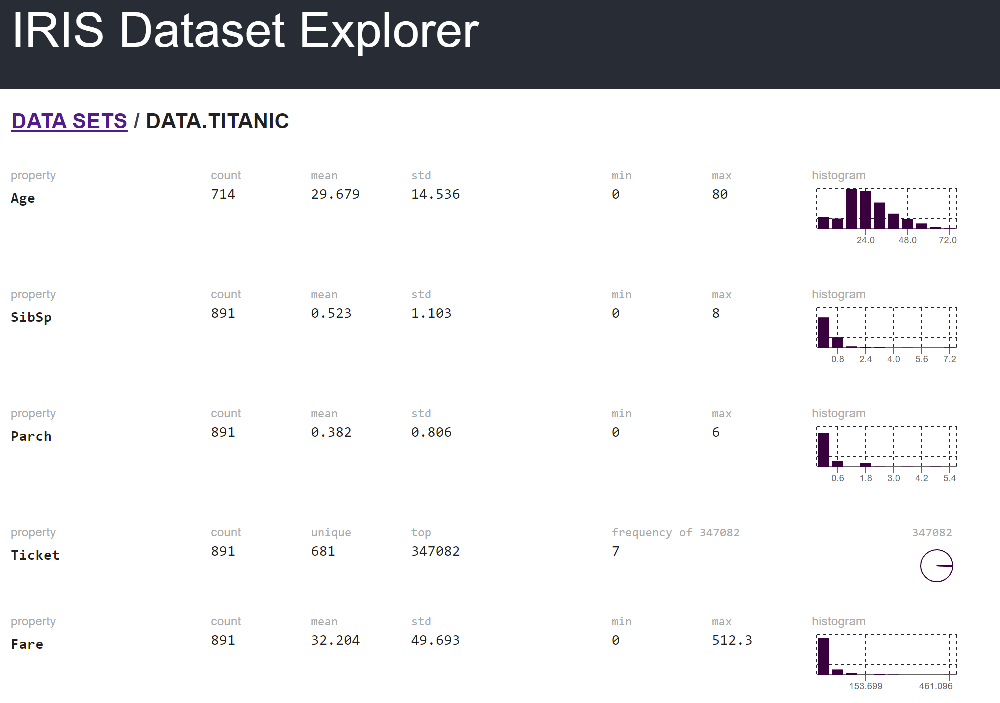

# irisdataexplorer

View a statistical summary of your data at the push of a button.

This repo consists of a REST web service for InterSystems IRIS that crunches the numbers and generates statistics, and an accompanying client web app built in React.

NOTE: Requires a version of IRIS with Embedded Python, **2021.2 and newer**.

## Installation

1. Import Service.Explorer into IRIS
2. Create a REST app in the `USER` namespace with the endpoint `/api/explorer` and give it %Developer permissions
3. Deploy the client 
    1. `cd app`
    2. `npm install`
    3. `yarn serve`

## Usage

1. Go to http://localhost:3000/ in your browser (if it doesn't open automatically). This will list all data sets in your namespace.
2. Click on a data set name. This will list all of the data set's properties.

  &nbsp;

